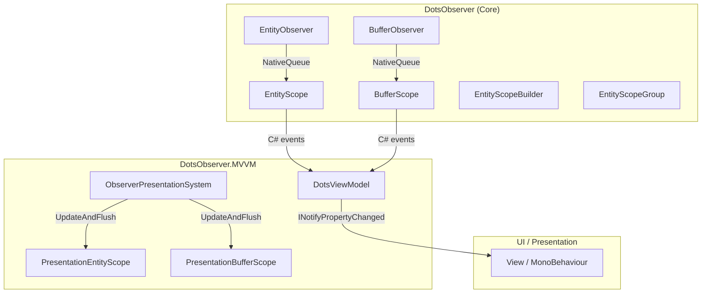
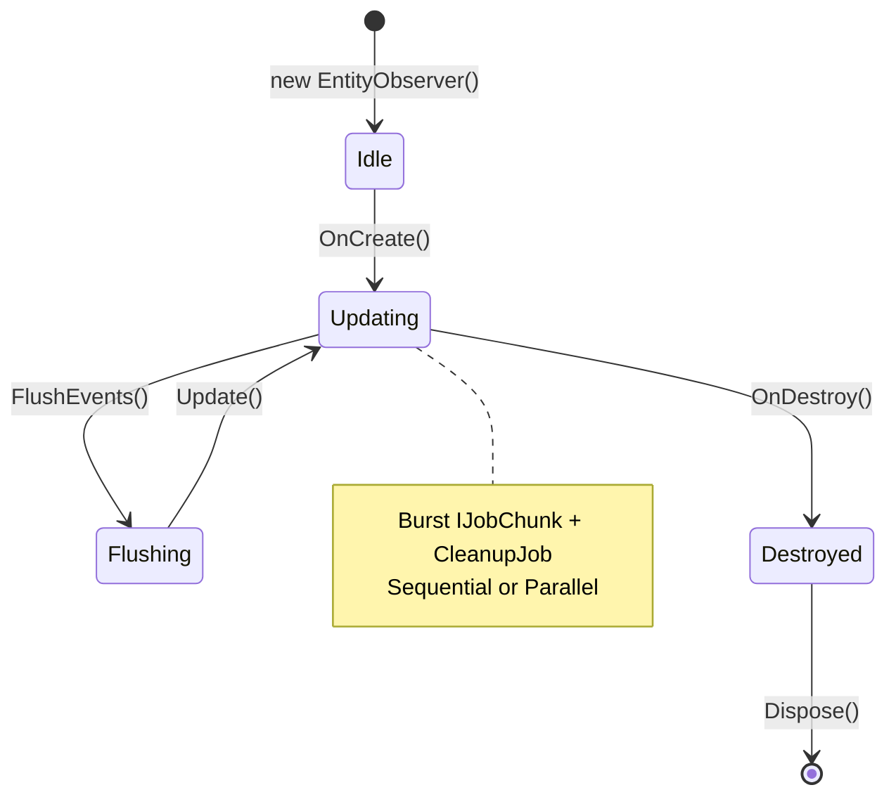
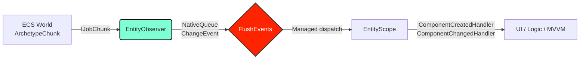

# DotsObserver

[Russian version](README.ru.md)

## Contents

- [From the author](#from-the-author)
- [What is this](#what-is-this)
- [Installation and requirements](#installation-and-requirements)
  - [Scripting Define Symbols](#scripting-define-symbols)
  - [Links](#links)
- [Quick start](#quick-start)
- [Architecture](#architecture)
  - [Package overview](#package-overview)
  - [EntityObserver lifecycle](#entityobserver-lifecycle)
  - [Data flow](#data-flow)
- [API](#api)
  - [EntityObserver&lt;T&gt;](#entityobservert)
  - [BufferObserver&lt;T&gt;](#bufferobservert)
  - [EntityScope and BufferScope](#entityscope-and-bufferscope)
  - [EntityScopeBuilder and EntityScopeGroup](#entityscopebuilder-and-entityscopegroup)
  - [ObserverConfig](#observerconfig)
  - [API Cheatsheet](#api-cheatsheet)
- [License](#license)

---

## From the author

The **DotsObserver** library and this documentation were entirely generated with AI.
The project has undergone comprehensive testing: together with the **DotsObserver.MVVM** package, a total of **161 unit tests** (NUnit + Unity Test Framework) have been implemented and passed, covering the core, MVVM layer, and integration scenarios.

---

## What is this

**DotsObserver** is a high-performance library for Unity DOTS/ECS that provides a reactive observation layer for changes to components (`IComponentData`) and dynamic buffers (`IBufferElementData`).

Key features:
- **Lifecycle events**: `Created`, `Changed`, `Destroyed`, `Enabled`, `Disabled`.
- **Burst-optimized Jobs**: `IJobChunk` with zero allocation in the hot loop.
- **Multiple change detection modes**: `ChangeFilterOnly`, `EqualsCheck` (MemCmp), `Both`.
- **`IEnableableComponent` support**: tracking component enable/disable state.
- **Zero-allocation API**: `NativeQueue`, `NativeParallelHashMap`, `NativeArray` — no managed allocations during update.
- **Managed wrappers**: `EntityScope<T>` and `BufferScope<T>` with familiar C# events for the UI layer.
- **Fluent builder**: `EntityScopeBuilder` for batch observer registration.

---

## Installation and requirements

- **Unity**: 2022.3 LTS or newer.
- **Entities**: 1.0.x (DOTS / Unity ECS).
- **Burst**, **Collections**, **Jobs**: standard DOTS packages.

### Scripting Define Symbols

Add to **Edit → Project Settings → Player → Scripting Define Symbols** if needed:

| Symbol | Description |
|--------|-------------|
| `DOTS_OBSERVER_USE_FNV1A` | Forces 32-bit FNV-1a for buffer hashing instead of xxHash3. |

### Links

- **[DotsObserver.MVVM](https://github.com/About00/dots-observer.mvvm)** — MVVM wrapper with `DotsViewModel`, `ComponentProperty<T>`, and two-way binding for UI integration.
- **[DotsObserver.Tests](https://github.com/About00/dots-observer.tests)** — a set of unit tests for the **DotsObserver** and **DotsObserver.MVVM** libraries.

---

## Quick start

```csharp
using DotsObserver;
using Unity.Entities;
using Unity.Collections;

public partial class HealthSystem : SystemBase
{
    private EntityObserver<Health> _observer;

    protected override void OnCreate()
    {
        var config = ObserverConfig.Default.With(
            trackEntityLifecycle: true,
            changeDetection: ChangeDetectionMode.Both);

        _observer = new EntityObserver<Health>();
        _observer.OnCreate(this, config);
    }

    protected override void OnUpdate()
    {
        _observer.Update(this);
        Dependency.Complete();

        var events = _observer.FlushEvents(Allocator.Temp);
        try
        {
            for (int i = 0; i < events.Length; i++)
            {
                var e = events[i];
                switch (e.Type)
                {
                    case ChangeEventType.Created:
                        UnityEngine.Debug.Log($"[Created] {e.Entity}: {e.NewValue}");
                        break;
                    case ChangeEventType.Changed:
                        UnityEngine.Debug.Log($"[Changed] {e.Entity}: {e.PreviousValue} -> {e.NewValue}");
                        break;
                    case ChangeEventType.Destroyed:
                        UnityEngine.Debug.Log($"[Destroyed] {e.Entity}");
                        break;
                }
            }
        }
        finally
        {
            events.Dispose();
        }
    }

    protected override void OnDestroy()
    {
        _observer.OnDestroy(this);
    }
}

public struct Health : IComponentData
{
    public int Value;
}
```

---

## Architecture

### Package overview



### EntityObserver lifecycle



### Data flow



---

## API

### EntityObserver&lt;T&gt;

The core of the system. Contains no managed references, safe for Burst.

| Method | Description |
|--------|-------------|
| `OnCreate(ref SystemState, config, watchedEntity)` | Initialization in `ISystem`. |
| `OnCreate(SystemBase, config, watchedEntity)` | Initialization in `SystemBase`. |
| `Update(ref SystemState)` / `Update(SystemBase)` | Runs change detection jobs. |
| `FlushEvents(Allocator)` | Returns `NativeArray<ChangeEvent<T>>` and clears the queue. |
| `UpdateAndFlush(..., Allocator)` | `Update` + `FlushEvents` in one call. |
| `GetEvents(Allocator)` | Returns a copy of events **without** clearing the queue. |
| `TryDequeue(out ChangeEvent<T>)` | Dequeues a single event (no limits). |
| `FlushToManagedEvents(Action<ChangeEvent<T>>)` | Synchronous flush with dispatch to delegate. |
| `GetMetrics()` | Returns `ObserverMetrics` (processed, dropped, pressure). |
| `ClearEvents()` | Clears the queue without returning data. |
| `OnDestroy(...)` / `Dispose()` | Releases native collections. |

### BufferObserver&lt;T&gt;

Analogous to `EntityObserver`, but for `IBufferElementData`. Uses content hashing (FNV-1a / xxHash3) for change detection.

| Method | Description |
|--------|-------------|
| `OnCreate(...)` / `Update(...)` / `FlushEvents(...)` | Same as `EntityObserver`. |
| `FlushToManagedEvents(Action<BufferChangeEvent<T>>)` | Dispatch to managed delegate. |

### EntityScope and BufferScope

Managed wrappers with C# events for main-thread code (UI, ViewModel).

```csharp
var scope = EntityScope<Health>.Create(ref state, entity, config);
scope.OnCreated += (in Entity e, in Health v) => { };
scope.OnChanged += (in Entity e, in Health p, in Health c) => { };
scope.OnDestroyed += (in Entity e, in Health l) => { };
scope.OnEnabled += (in Entity e, in Health v) => { };
scope.OnDisabled += (in Entity e, in Health l) => { };
scope.UpdateAndFlush(ref state);
scope.Dispose(ref state);
```

### EntityScopeBuilder and EntityScopeGroup

```csharp
// Fluent builder
var builder = new EntityScopeBuilder(config.With(trackEntityLifecycle: true));
builder.Watch<Health>(ref state, playerEntity);
builder.Watch<Mana>(ref state, playerEntity);
builder.WatchBuffer<InventoryItem>(ref state, playerEntity);
var group = builder.Build();

// Bulk operations
group.UpdateAll(ref state);
group.FlushAll(ref state);
group.UpdateAndFlushAll(ref state);
group.DisposeAll(ref state);
```

### ObserverConfig

```csharp
public struct ObserverConfig
{
    public int UpdateInterval;        // 1 = every frame
    public ScheduleMode Mode;         // Sequential (recommended)
    public ChangeDetectionMode ChangeDetection; // Both (default)
    public ObserverExecutionMode ExecutionMode; // BurstJob or MainThread
    public int MaxEventsPerFrame;     // 0 = no limit
    public bool TrackEntityLifecycle; // Created / Destroyed
    public bool TrackEnableable;      // Enabled / Disabled
    public int RingQueueCapacity;     // 0 = NativeQueue, >0 = ring buffer
    public int MaxQueueSize;          // Hard limit on output
}
```

Creation via `With(...)`:
```csharp
var config = ObserverConfig.Default.With(
    trackEntityLifecycle: true,
    changeDetection: ChangeDetectionMode.EqualsCheck,
    executionMode: ObserverExecutionMode.MainThread);
```

### API Cheatsheet

```csharp
// === EntityObserver (Core) ===
var observer = new EntityObserver<Health>();
observer.OnCreate(ref systemState, ObserverConfig.Default);
observer.Update(ref systemState);
var events = observer.FlushEvents(Allocator.Temp);
events.Dispose();

// === EntityScope (Managed) ===
var scope = EntityScope<Health>.Create(ref state, entity, config);
scope.OnChanged += (e, p, c) => { };
scope.UpdateAndFlush(ref state);
scope.Dispose(ref state);

// === BufferScope ===
var bScope = BufferScope<InventoryItem>.Create(ref state, entity, config);
bScope.OnBufferChanged += (e) => { };

// === Builder + Group ===
var builder = new EntityScopeBuilder(ObserverConfig.Default.With(trackEntityLifecycle: true));
builder.Watch<Health>(ref state, entity);
builder.WatchBuffer<InventoryItem>(ref state, entity);
var group = builder.Build();
group.UpdateAndFlushAll(ref state);
group.DisposeAll(ref state);

// === Config ===
var cfg = ObserverConfig.Default.With(
    updateInterval: 2,
    changeDetection: ChangeDetectionMode.Both,
    maxEventsPerFrame: 500,
    trackEnableable: true);
```

---

## License

MIT License. See `LICENSE` file for details.
