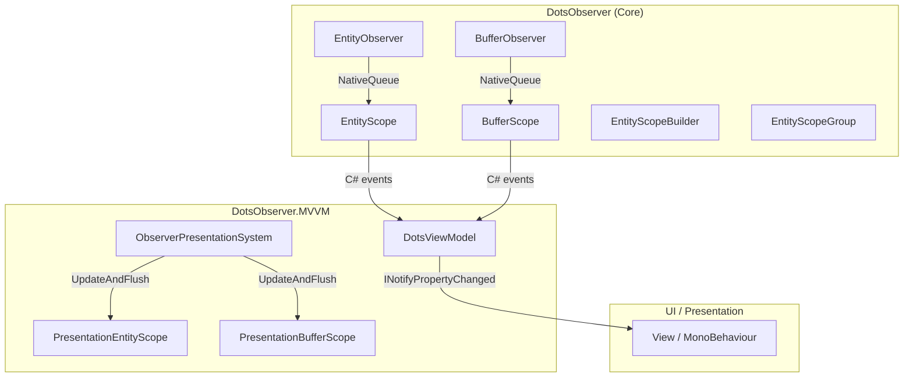
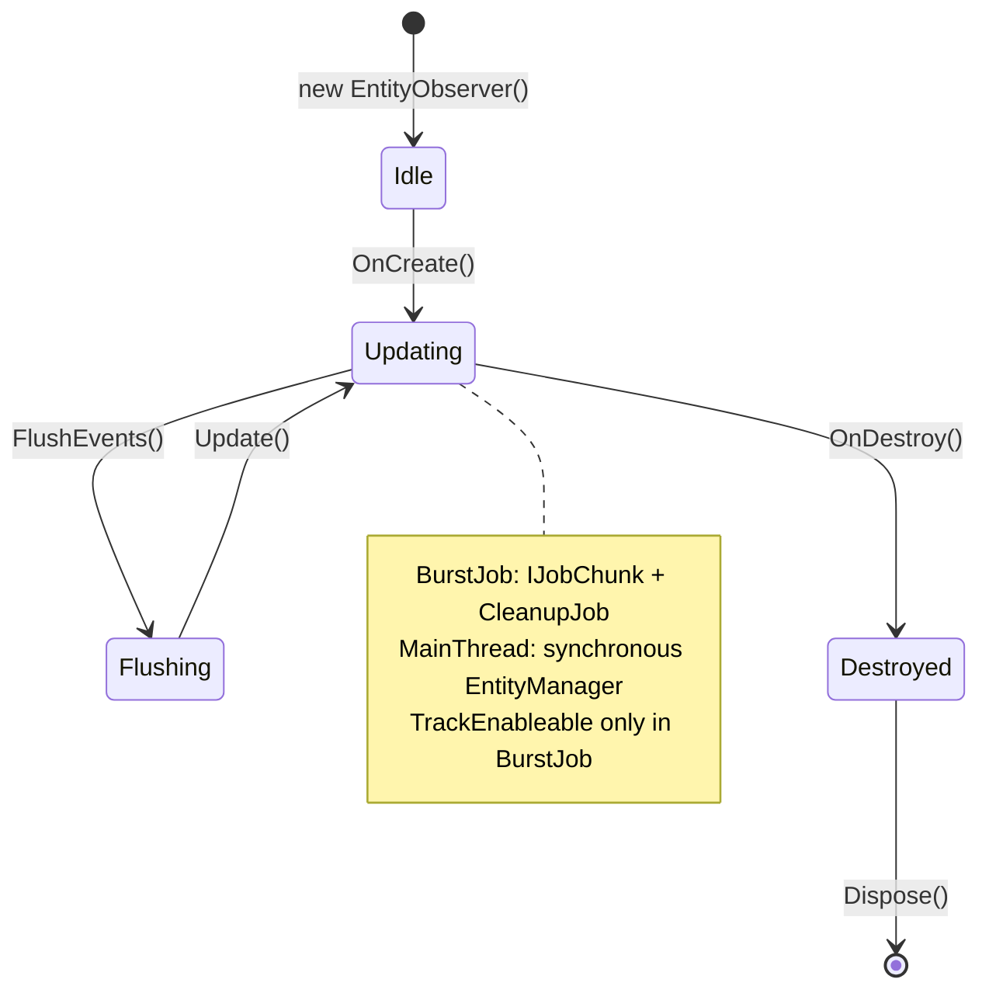
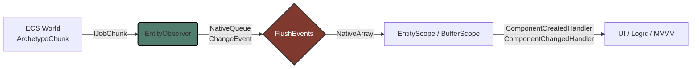

# DotsObserver

[Russian version](README.ru.md)

## Table of Contents

- [From the Author](#from-the-author)
- [What Is This](#what-is-this)
- [Installation & Requirements](#installation--requirements)
  - [Scripting Define Symbols](#scripting-define-symbols)
  - [Links](#links)
- [Quick Start](#quick-start)
- [Architecture](#architecture)
  - [Package Overview](#package-overview)
  - [EntityObserver Lifecycle](#entityobserver-lifecycle)
  - [Data Flow](#data-flow)
- [API](#api)
  - [EntityObserver&lt;T&gt;](#entityobservert)
  - [BufferObserver&lt;T&gt;](#bufferobservert)
  - [EntityScope and BufferScope](#entityscope-and-bufferscope)
  - [EntityScopeBuilder and EntityScopeGroup](#entityscopebuilder-and-entityscopegroup)
  - [ObserverConfig Configuration](#observerconfig-configuration)
  - [Automatic Scheduler Selection](#automatic-scheduler-selection)
  - [API Cheatsheet](#api-cheatsheet)
- [License](#license)

---

## From the Author

The **DotsObserver** library and this documentation were fully generated with the help of AI.  
The project has undergone comprehensive testing: together with the **DotsObserver.MVVM** package, **199 unit tests** (NUnit + Unity Test Framework) were implemented and successfully passed, covering the core, MVVM layer, and integration scenarios.

---

## What Is This

**DotsObserver** is a high-performance library for Unity DOTS/ECS that provides a reactive observation layer for component changes (`IComponentData`) and dynamic buffers (`IBufferElementData`).

Key features:
- **Lifecycle events**: `Created`, `Changed`, `Destroyed`, `Enabled`, `Disabled`.
- **Burst-optimized Jobs**: `IJobChunk` with zero allocation in the hot loop.
- **Multiple change detection modes**: `ChangeFilterOnly`, `EqualsCheck` (MemCmp), `Both`.
- **Automatic `IEquatable<T>` optimization**: if a component implements `IEquatable<T>`, the scheduler automatically switches to `T.Equals()` instead of MemCmp.
- **`IEnableableComponent` support**: tracking component enable/disable state.
- **Two execution modes**: `BurstJob` (default) and `MainThread` (synchronous, no job overhead).
- **Custom `EntityQuery` support**: pass a custom filtered query when creating an observer.
- **Wildcard mode**: observe all entities with a given component at once.
- **Zero-allocation API**: `NativeQueue`, `NativeParallelHashMap`, `NativeArray` — no managed allocations during update.
- **Managed wrappers**: `EntityScope<T>` and `BufferScope<T>` with familiar C# events for the UI layer.
- **Enable/Disable scopes**: pause observation without destroying the object.
- **Fluent builder**: `EntityScopeBuilder` for batch observer registration.

---

## Installation & Requirements

- **Unity**: 2022.3 LTS or newer.
- **Entities**: 1.0.x (DOTS / Unity ECS).
- **Burst**, **Collections**, **Jobs**: standard DOTS packages.

### Scripting Define Symbols

Add the following to **Edit → Project Settings → Player → Scripting Define Symbols** if needed:

| Symbol | Description |
|--------|-------------|
| `DOTS_OBSERVER_USE_FNV1A` | Forces 32-bit FNV-1a for buffer hashing instead of xxHash3 (default). |

### Links

- **[DotsObserver.MVVM](https://github.com/About00/dots-observer.mvvm)** — MVVM wrapper with `DotsViewModel`, `ComponentProperty<T>`, and two-way binding for UI integration.
- **[DotsObserver.Tests](https://github.com/About00/dots-observer.tests)** — unit test suite for the **DotsObserver** and **DotsObserver.MVVM** libraries.

---

## Quick Start

```csharp
using DotsObserver;
using Unity.Entities;
using Unity.Collections;

public partial class HealthSystem : SystemBase
{
    private EntityObserver<Health> _observer;

    protected override void OnCreate()
    {
        var config = ObserverConfig.Default.With(
            trackEntityLifecycle: true,
            changeDetection: ChangeDetectionMode.Both);

        _observer = new EntityObserver<Health>();
        _observer.OnCreate(this, config);
    }

    protected override void OnUpdate()
    {
        _observer.Update(this);
        Dependency.Complete();

        var events = _observer.FlushEvents(Allocator.Temp);
        try
        {
            for (int i = 0; i < events.Length; i++)
            {
                var e = events[i];
                switch (e.Type)
                {
                    case ChangeEventType.Created:
                        UnityEngine.Debug.Log($"[Created] {e.Entity}: {e.NewValue}");
                        break;
                    case ChangeEventType.Changed:
                        UnityEngine.Debug.Log($"[Changed] {e.Entity}: {e.PreviousValue} -> {e.NewValue}");
                        break;
                    case ChangeEventType.Destroyed:
                        UnityEngine.Debug.Log($"[Destroyed] {e.Entity}");
                        break;
                }
            }
        }
        finally
        {
            events.Dispose();
        }
    }

    protected override void OnDestroy()
    {
        _observer.OnDestroy(this);
    }
}

public struct Health : IComponentData
{
    public int Value;
}
```

| Usage Scenario | Complete calls per frame | Notes |
| --- | --- | --- |
| **MVVM via `ObserverPresentationSystem`** (recommended) | **1** (centralized) | All batch jobs are combined into a single `JobHandle` and completed with one `Complete()` in `OnUpdate`. Fallback scopes make additional calls, but on an already-completed `Dependency` (practically no-op). |
| **`EntityScope<T>.UpdateAndFlush()`** or **`BufferScope<T>.UpdateAndFlush()`** (ISystem) | **2 × N** | `Update()` calls `Complete()` before clearing the queue; `Flush()` calls a second `Complete()` before reading events. N = number of scopes. |
| **`EntityObserver<T>.Update()`** / **`BufferObserver<T>.Update()`** (low-level) | **1 × N** | One `Complete()` per observer at the start of `Update()`. |
| **`EntityObserver<T>.UpdateAndFlush()`** | **2 × N** | Same as scopes: one in `Update()`, second before `FlushEvents()`. |

---

## Architecture

### Package Overview



### EntityObserver Lifecycle



### Data Flow



---

## API

### EntityObserver&lt;T&gt;

The core of the system. Contains no managed references; safe for Burst.

| Method | Description |
|--------|-------------|
| `OnCreate(ref SystemState, config, watchedEntity)` | Initialization in `ISystem`. |
| `OnCreate(ref SystemState, config, customQuery, watchedEntity)` | Initialization with a custom `EntityQuery`. |
| `OnCreate(SystemBase, config, watchedEntity)` | Initialization in `SystemBase`. |
| `OnCreate(SystemBase, config, customQuery, watchedEntity)` | Initialization in `SystemBase` with a custom `EntityQuery`. |
| `Update(ref SystemState)` / `Update(SystemBase)` | Runs change detection jobs (or synchronous update in `MainThread` mode). |
| `FlushEvents(Allocator)` | Returns a `NativeArray<ChangeEvent<T>>` and clears the queue. |
| `UpdateAndFlush(..., Allocator)` | `Update` + `FlushEvents` in a single call. |
| `GetEvents(Allocator)` | Returns a copy of events **without** clearing the queue. |
| `TryDequeue(out ChangeEvent<T>)` | Dequeues a single event (no limits). |
| `FlushToManagedEvents(Action<ChangeEvent<T>>)` | Synchronous flush with dispatch to a delegate. |
| `GetMetrics()` | Returns `ObserverMetrics` (processed, dropped, pressure). |
| `ClearEvents()` | Clears the queue without returning data. |
| `OnDestroy(...)` / `Dispose()` | Releases native collections. |

> **MainThread mode**: when `ExecutionMode = ObserverExecutionMode.MainThread`, the update runs synchronously via `EntityManager` without scheduling a job. `TrackEnableable` is not supported in this mode and will be ignored.

### BufferObserver&lt;T&gt;

The counterpart of `EntityObserver`, but for `IBufferElementData`. Uses content hashing (xxHash3 by default, FNV-1a when `DOTS_OBSERVER_USE_FNV1A` is set) for change detection.

| Method | Description |
|--------|-------------|
| `OnCreate(...)` / `Update(...)` / `FlushEvents(...)` | Same as `EntityObserver`. |
| `FlushToManagedEvents(Action<BufferChangeEvent<T>>)` | Dispatch to a managed delegate. |

### EntityScope and BufferScope

Managed wrappers with C# events for main-thread code (UI, ViewModel). Support pausing via `Enable()` / `Disable()`.

```csharp
// Observe a specific entity
var scope = EntityScope<Health>.Create(ref state, entity, config);

// Wildcard: observe all entities with the component
var scope = EntityScope<Health>.CreateWildcard(ref state, config);

// With a custom EntityQuery
var scope = EntityScope<Health>.Create(ref state, customQuery, config, entity);

scope.OnCreated   += (in Entity e, in Health v) => { };
scope.OnChanged   += (in Entity e, in Health p, in Health c) => { };
scope.OnDestroyed += (in Entity e, in Health l) => { };
scope.OnEnabled   += (in Entity e, in Health v) => { };
scope.OnDisabled  += (in Entity e, in Health l) => { };

scope.Enable();              // resume observation
scope.Disable();             // pause without destroying

scope.UpdateAndFlush(ref state);
scope.Dispose(ref state);
```

### EntityScopeBuilder and EntityScopeGroup

```csharp
// Fluent builder
var builder = new EntityScopeBuilder(config.With(trackEntityLifecycle: true));

// Observe a specific entity
builder.Watch<Health>(ref state, playerEntity);
builder.Watch<Mana>(ref state, playerEntity);

// Wildcard: all entities with the component
builder.WatchAll<Health>(ref state);
builder.WatchAll<Health>(ref state, customQuery);  // with filter

// Buffers
builder.WatchBuffer<InventoryItem>(ref state, playerEntity);
builder.WatchAllBuffers<InventoryItem>(ref state);

// With a custom EntityQuery
builder.Watch<Health>(ref state, playerEntity, customQuery);

var group = builder.Build();

// Bulk operations on the group
group.UpdateAll(ref state);
group.FlushAll(ref state);
group.UpdateAndFlushAll(ref state);
group.EnableAll();
group.DisableAll();
group.DisposeAll(ref state);
```

### ObserverConfig Configuration

```csharp
public struct ObserverConfig
{
    public int UpdateInterval;        // 1 = every frame
    public ScheduleMode Mode;         // Parallel (default)
    public ChangeDetectionMode ChangeDetection; // Both (default)
    public ObserverExecutionMode ExecutionMode; // BurstJob or MainThread
    public int MaxEventsPerFrame;     // 1000 by default (0 = unlimited)
    public bool TrackEntityLifecycle; // Created / Destroyed
    public bool TrackEnableable;      // Enabled / Disabled (BurstJob only)
    public int RingQueueCapacity;     // 0 = NativeQueue, >0 = ring queue
    public int MaxQueueSize;          // Hard limit on output
}
```

**Default values** (`ObserverConfig.Default`):

| Field | Value |
|-------|-------|
| `UpdateInterval` | 1 |
| `Mode` | `Parallel` |
| `ChangeDetection` | `Both` |
| `ExecutionMode` | `BurstJob` |
| `MaxEventsPerFrame` | **1000** |
| `TrackEntityLifecycle` | `false` |
| `TrackEnableable` | `false` |
| `RingQueueCapacity` | 0 |
| `MaxQueueSize` | 0 |

Creation via `With(...)`:
```csharp
var config = ObserverConfig.Default.With(
    trackEntityLifecycle: true,
    changeDetection: ChangeDetectionMode.EqualsCheck,
    executionMode: ObserverExecutionMode.MainThread,
    maxEventsPerFrame: 500);
```

### Automatic Scheduler Selection

`EntityObserver<T>` automatically selects the optimal scheduler based on the component type:

| Condition | Scheduler | Behavior |
|-----------|-----------|----------|
| `T : IEnableableComponent` + `trackEnableable: true` | `EnableableUpdateScheduler<T>` | Tracks `Enabled`/`Disabled` |
| `T : IEquatable<T>` | `EquatableUpdateScheduler<T>` | Uses `T.Equals()` instead of MemCmp |
| Everything else | `RegularUpdateScheduler<T>` | MemCmp for comparison |

Selection happens once during `OnCreate` via reflection; runtime cost is zero.

### API Cheatsheet

```csharp
// === EntityObserver (Core) ===
var observer = new EntityObserver<Health>();
observer.OnCreate(ref systemState, ObserverConfig.Default);
observer.Update(ref systemState);
var events = observer.FlushEvents(Allocator.Temp);
events.Dispose();

// === EntityObserver with custom query ===
observer.OnCreate(ref systemState, config, myCustomQuery);

// === EntityScope (Managed) ===
var scope = EntityScope<Health>.Create(ref state, entity, config);
scope.OnChanged += (e, p, c) => { };
scope.Enable();
scope.Disable();
scope.UpdateAndFlush(ref state);
scope.Dispose(ref state);

// === EntityScope wildcard ===
var wildScope = EntityScope<Health>.CreateWildcard(ref state, config);

// === BufferScope ===
var bScope = BufferScope<InventoryItem>.Create(ref state, entity, config);
bScope.OnBufferChanged += (e) => { };

// === BufferScope wildcard ===
var bWild = BufferScope<InventoryItem>.CreateWildcard(ref state, config);

// === Builder + Group ===
var builder = new EntityScopeBuilder(ObserverConfig.Default.With(trackEntityLifecycle: true));
builder.Watch<Health>(ref state, entity);
builder.WatchAll<Mana>(ref state);
builder.WatchBuffer<InventoryItem>(ref state, entity);
builder.WatchAllBuffers<InventoryItem>(ref state);
var group = builder.Build();
group.UpdateAndFlushAll(ref state);
group.EnableAll();
group.DisableAll();
group.DisposeAll(ref state);

// === Config ===
var cfg = ObserverConfig.Default.With(
    updateInterval: 2,
    changeDetection: ChangeDetectionMode.Both,
    maxEventsPerFrame: 500,
    trackEnableable: true,
    executionMode: ObserverExecutionMode.MainThread);
```

---

## License

MIT License. See the `LICENSE` file for details.