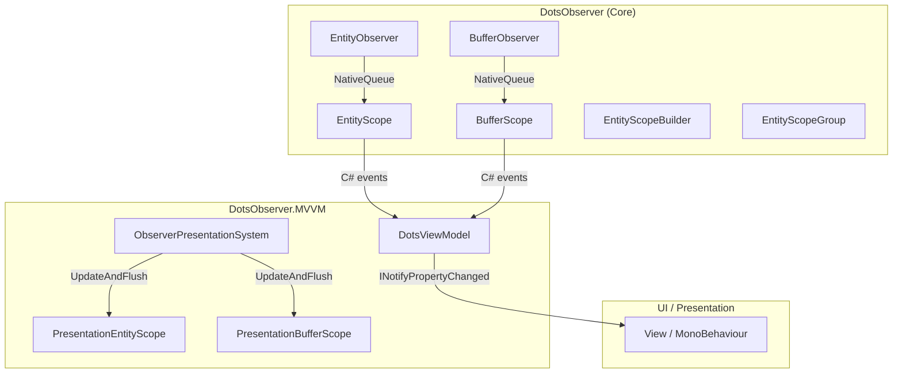
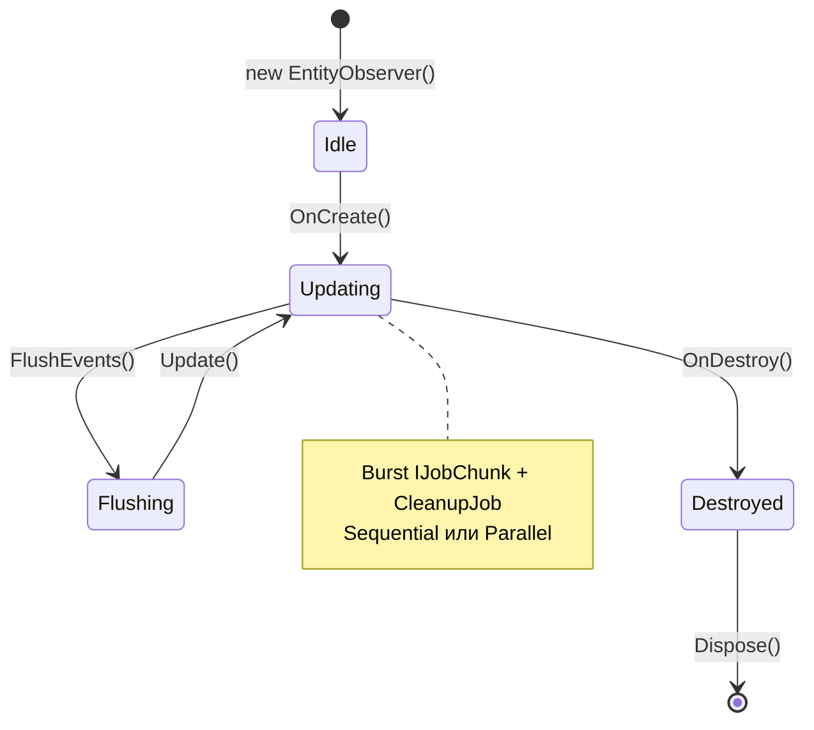
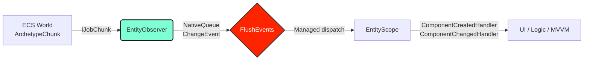

# DotsObserver

[English version](README.md)

## Содержание

- [От автора](#от-автора)
- [Что это такое](#что-это-такое)
- [Установка и требования](#установка-и-требования)
  - [Scripting Define Symbols](#scripting-define-symbols)
  - [Ссылки](#ссылки)
- [Быстрый старт](#быстрый-старт)
- [Архитектура](#архитектура)
  - [Обзор пакетов](#обзор-пакетов)
  - [Жизненный цикл EntityObserver](#жизненный-цикл-entityobserver)
  - [Поток данных](#поток-данных)
- [API](#api)
  - [EntityObserver&lt;T&gt;](#entityobservert)
  - [BufferObserver&lt;T&gt;](#bufferobservert)
  - [EntityScope и BufferScope](#entityscope-и-bufferscope)
  - [EntityScopeBuilder и EntityScopeGroup](#entityscopebuilder-и-entityscopegroup)
  - [Конфигурация ObserverConfig](#конфигурация-observerconfig)
  - [API Cheatsheet](#api-cheatsheet)
- [Лицензия](#лицензия)

---

## От автора

Библиотека **DotsObserver** и данная документация полностью сгенерированы с помощью ИИ.  
Проект прошёл комплексное тестирование: суммарно с пакетом **DotsObserver.MVVM** реализовано и успешно пройдено **161 unit-тест** (NUnit + Unity Test Framework), покрывающий ядро, MVVM-слой и интеграционные сценарии.

---

## Что это такое

**DotsObserver** — высокопроизводительная библиотека для Unity DOTS/ECS, предоставляющая реактивный слой наблюдения за изменениями компонентов (`IComponentData`) и динамических буферов (`IBufferElementData`).

Основные возможности:
- **События жизненного цикла**: `Created`, `Changed`, `Destroyed`, `Enabled`, `Disabled`.
- **Burst-оптимизированные Job'ы**: `IJobChunk` с нулевой аллокацией в горячем цикле.
- **Несколько режимов детекции изменений**: `ChangeFilterOnly`, `EqualsCheck` (MemCmp), `Both`.
- **Поддержка `IEnableableComponent`**: отслеживание включения/выключения компонентов.
- **Zero-allocation API**: `NativeQueue`, `NativeParallelHashMap`, `NativeArray` — никаких managed-аллокаций во время обновления.
- **Managed обёртки**: `EntityScope<T>` и `BufferScope<T>` с привычными C#-событиями для UI-слоя.
- **Fluent builder**: `EntityScopeBuilder` для батчевой регистрации наблюдателей.

---

## Установка и требования

- **Unity**: 2022.3 LTS или новее.
- **Entities**: 1.0.x (DOTS / Unity ECS).
- **Burst**, **Collections**, **Jobs**: стандартные пакеты DOTS.

### Scripting Define Symbols

Добавьте в **Edit → Project Settings → Player → Scripting Define Symbols** при необходимости:

| Символ | Описание |
|--------|----------|
| `DOTS_OBSERVER_USE_FNV1A` | Принудительно использует 32-битный FNV-1a для хэширования буферов вместо xxHash3. |

### Ссылки

- **[DotsObserver.MVVM](https://github.com/About00/dots-observer.mvvm)** — MVVM-обёртка с `DotsViewModel`, `ComponentProperty<T>` и двусторонним биндингом для интеграции с UI.
- **[DotsObserver.Tests](https://github.com/About00/dots-observer.tests)** — набор unit-тестов для библиотек **DotsObserver** и **DotsObserver.MVVM**.

---

## Быстрый старт

```csharp
using DotsObserver;
using Unity.Entities;
using Unity.Collections;

public partial class HealthSystem : SystemBase
{
    private EntityObserver<Health> _observer;

    protected override void OnCreate()
    {
        var config = ObserverConfig.Default.With(
            trackEntityLifecycle: true,
            changeDetection: ChangeDetectionMode.Both);

        _observer = new EntityObserver<Health>();
        _observer.OnCreate(this, config);
    }

    protected override void OnUpdate()
    {
        _observer.Update(this);
        Dependency.Complete();

        var events = _observer.FlushEvents(Allocator.Temp);
        try
        {
            for (int i = 0; i < events.Length; i++)
            {
                var e = events[i];
                switch (e.Type)
                {
                    case ChangeEventType.Created:
                        UnityEngine.Debug.Log($"[Created] {e.Entity}: {e.NewValue}");
                        break;
                    case ChangeEventType.Changed:
                        UnityEngine.Debug.Log($"[Changed] {e.Entity}: {e.PreviousValue} -> {e.NewValue}");
                        break;
                    case ChangeEventType.Destroyed:
                        UnityEngine.Debug.Log($"[Destroyed] {e.Entity}");
                        break;
                }
            }
        }
        finally
        {
            events.Dispose();
        }
    }

    protected override void OnDestroy()
    {
        _observer.OnDestroy(this);
    }
}

public struct Health : IComponentData
{
    public int Value;
}
```

---

## Архитектура

### Обзор пакетов



### Жизненный цикл EntityObserver



### Поток данных



---

## API

### EntityObserver&lt;T&gt;

Ядро системы. Не содержит managed-ссылок, безопасен для Burst.

| Метод | Описание |
|-------|----------|
| `OnCreate(ref SystemState, config, watchedEntity)` | Инициализация в `ISystem`. |
| `OnCreate(SystemBase, config, watchedEntity)` | Инициализация в `SystemBase`. |
| `Update(ref SystemState)` / `Update(SystemBase)` | Выполняет Job'ы детекции изменений. |
| `FlushEvents(Allocator)` | Возвращает `NativeArray<ChangeEvent<T>>` и очищает очередь. |
| `UpdateAndFlush(..., Allocator)` | `Update` + `FlushEvents` в одном вызове. |
| `GetEvents(Allocator)` | Возвращает копию событий **без** очистки очереди. |
| `TryDequeue(out ChangeEvent<T>)` | Извлекает одно событие (без лимитов). |
| `FlushToManagedEvents(Action<ChangeEvent<T>>)` | Синхронный flush с диспетчеризацией в делегат. |
| `GetMetrics()` | Возвращает `ObserverMetrics` (processed, dropped, pressure). |
| `ClearEvents()` | Очищает очередь без возврата данных. |
| `OnDestroy(...)` / `Dispose()` | Освобождение нативных коллекций. |

### BufferObserver&lt;T&gt;

Аналог `EntityObserver`, но для `IBufferElementData`. Использует хэширование содержимого (FNV-1a / xxHash3) для детекции изменений.

| Метод | Описание |
|-------|----------|
| `OnCreate(...)` / `Update(...)` / `FlushEvents(...)` | Аналогично `EntityObserver`. |
| `FlushToManagedEvents(Action<BufferChangeEvent<T>>)` | Диспетчеризация в managed-делегат. |

### EntityScope и BufferScope

Managed обёртки с C#-событиями для main-thread кода (UI, ViewModel).

```csharp
var scope = EntityScope<Health>.Create(ref state, entity, config);
scope.OnCreated += (in Entity e, in Health v) => { };
scope.OnChanged += (in Entity e, in Health p, in Health c) => { };
scope.OnDestroyed += (in Entity e, in Health l) => { };
scope.OnEnabled += (in Entity e, in Health v) => { };
scope.OnDisabled += (in Entity e, in Health l) => { };
scope.UpdateAndFlush(ref state);
scope.Dispose(ref state);
```

### EntityScopeBuilder и EntityScopeGroup

```csharp
// Fluent builder
var builder = new EntityScopeBuilder(config.With(trackEntityLifecycle: true));
builder.Watch<Health>(ref state, playerEntity);
builder.Watch<Mana>(ref state, playerEntity);
builder.WatchBuffer<InventoryItem>(ref state, playerEntity);
var group = builder.Build();

// Bulk-операции
group.UpdateAll(ref state);
group.FlushAll(ref state);
group.UpdateAndFlushAll(ref state);
group.DisposeAll(ref state);
```

### Конфигурация ObserverConfig

```csharp
public struct ObserverConfig
{
    public int UpdateInterval;        // 1 = каждый кадр
    public ScheduleMode Mode;         // Sequential (рекомендуется)
    public ChangeDetectionMode ChangeDetection; // Both (по умолчанию)
    public ObserverExecutionMode ExecutionMode; // BurstJob или MainThread
    public int MaxEventsPerFrame;     // 0 = без лимита
    public bool TrackEntityLifecycle; // Created / Destroyed
    public bool TrackEnableable;      // Enabled / Disabled
    public int RingQueueCapacity;     // 0 = NativeQueue, >0 = кольцевая
    public int MaxQueueSize;          // Жёсткий лимит на выдачу
}
```

Создание через `With(...)`:
```csharp
var config = ObserverConfig.Default.With(
    trackEntityLifecycle: true,
    changeDetection: ChangeDetectionMode.EqualsCheck,
    executionMode: ObserverExecutionMode.MainThread);
```

### API Cheatsheet

```csharp
// === EntityObserver (Core) ===
var observer = new EntityObserver<Health>();
observer.OnCreate(ref systemState, ObserverConfig.Default);
observer.Update(ref systemState);
var events = observer.FlushEvents(Allocator.Temp);
events.Dispose();

// === EntityScope (Managed) ===
var scope = EntityScope<Health>.Create(ref state, entity, config);
scope.OnChanged += (e, p, c) => { };
scope.UpdateAndFlush(ref state);
scope.Dispose(ref state);

// === BufferScope ===
var bScope = BufferScope<InventoryItem>.Create(ref state, entity, config);
bScope.OnBufferChanged += (e) => { };

// === Builder + Group ===
var builder = new EntityScopeBuilder(ObserverConfig.Default.With(trackEntityLifecycle: true));
builder.Watch<Health>(ref state, entity);
builder.WatchBuffer<InventoryItem>(ref state, entity);
var group = builder.Build();
group.UpdateAndFlushAll(ref state);
group.DisposeAll(ref state);

// === Config ===
var cfg = ObserverConfig.Default.With(
    updateInterval: 2,
    changeDetection: ChangeDetectionMode.Both,
    maxEventsPerFrame: 500,
    trackEnableable: true);
```

---

## Лицензия

MIT License. Подробности см. в файле `LICENSE`.
